# IOTPlatform 物联网平台 UML 设计文档

## 文档信息

| 项目 | 内容 |
|------|------|
| 项目名称 | IOTPlatform |
| 版本 | v1.0 |
| UML 工具 | Mermaid / PlantUML（可在任意支持 Markdown 的编辑器中渲染） |

---

## 一、类图 (Class Diagram) - 数据库实体关系

### 1.1 枚举类型

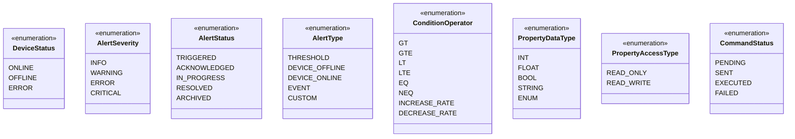

### 1.2 核心实体类图

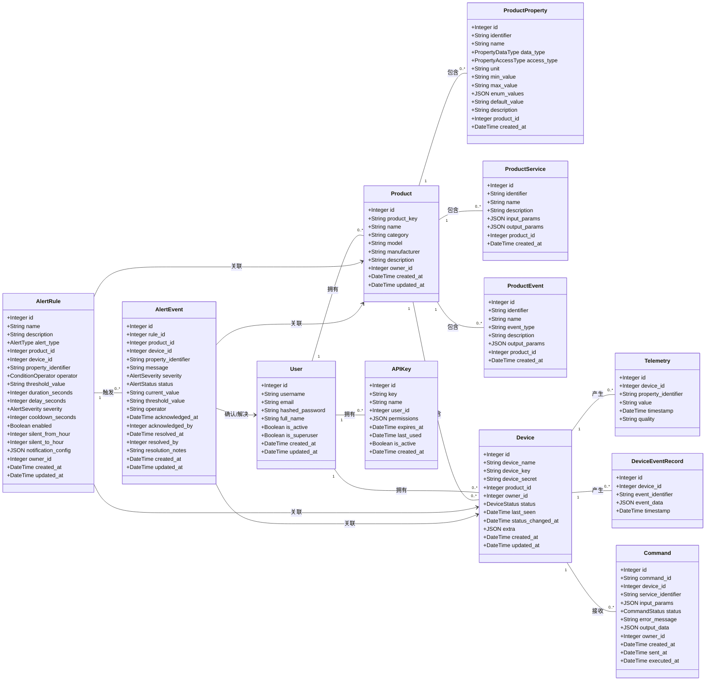

### 1.3 数据库关系 ER 图

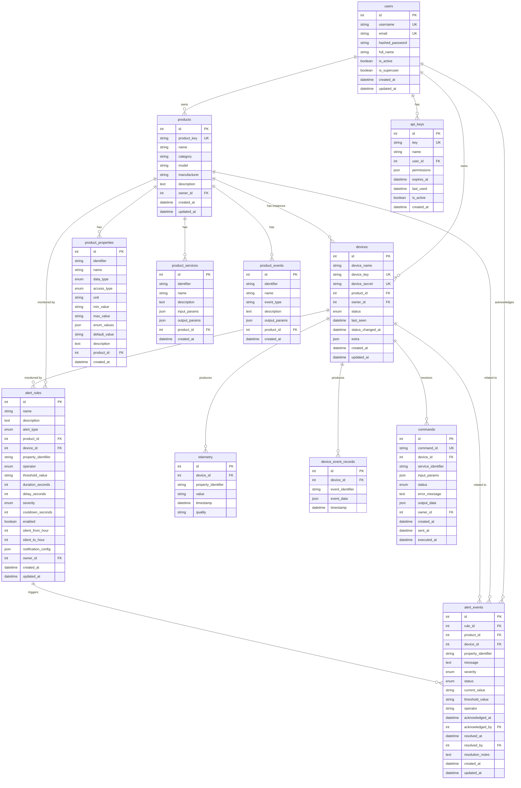

---

## 二、用例图 (Use Case Diagram)

```mermaid
usecaseDiagram
    actor User as "用户"
    actor Device as "设备/模拟器"
    actor ThirdParty as "第三方应用"

    package "用户认证" {
        usecase UC1 as "登录"
        usecase UC2 as "获取当前用户信息"
    }

    package "产品管理" {
        usecase UC3 as "创建产品"
        usecase UC4 as "查看产品列表"
        usecase UC5 as "编辑产品"
        usecase UC6 as "删除产品"
        usecase UC7 as "管理产品属性"
        usecase UC8 as "管理产品服务"
        usecase UC9 as "管理产品事件"
    }

    package "设备管理" {
        usecase UC10 as "创建设备"
        usecase UC11 as "查看设备列表"
        usecase UC12 as "查看设备详情"
        usecase UC13 as "编辑设备"
        usecase UC14 as "删除设备"
        usecase UC15 as "重新生成设备密钥"
    }

    package "遥测数据" {
        usecase UC16 as "查看遥测数据"
        usecase UC17 as "按设备/属性筛选"
        usecase UC18 as "上报遥测数据"
    }

    package "命令下发" {
        usecase UC19 as "发送命令"
        usecase UC20 as "查看命令历史"
        usecase UC21 as "接收命令并执行"
        usecase UC22 as "上报命令执行结果"
    }

    package "告警管理" {
        usecase UC23 as "创建告警规则"
        usecase UC24 as "管理告警规则"
        usecase UC25 as "查看告警事件"
        usecase UC26 as "确认告警"
        usecase UC27 as "标记告警已解决"
        usecase UC28 as "实时接收告警推送"
    }

    package "API 管理" {
        usecase UC29 as "创建 API 密钥"
        usecase UC30 as "管理 API 密钥"
        usecase UC31 as "通过 API Key 访问接口"
    }

    package "仪表盘" {
        usecase UC32 as "查看设备状态总览"
        usecase UC33 as "查看数据统计图表"
    }

    %% 用户用例
    User --> UC1
    User --> UC2
    User --> UC3
    User --> UC4
    User --> UC5
    User --> UC6
    User --> UC7
    User --> UC8
    User --> UC9
    User --> UC10
    User --> UC11
    User --> UC12
    User --> UC13
    User --> UC14
    User --> UC15
    User --> UC16
    User --> UC17
    User --> UC19
    User --> UC20
    User --> UC23
    User --> UC24
    User --> UC25
    User --> UC26
    User --> UC27
    User --> UC28
    User --> UC29
    User --> UC30
    User --> UC32
    User --> UC33

    %% 设备用例
    Device --> UC18
    Device --> UC21
    Device --> UC22

    %% 第三方应用用例
    ThirdParty --> UC31
```

---

## 三、时序图 (Sequence Diagram)

### 3.1 用户登录流程

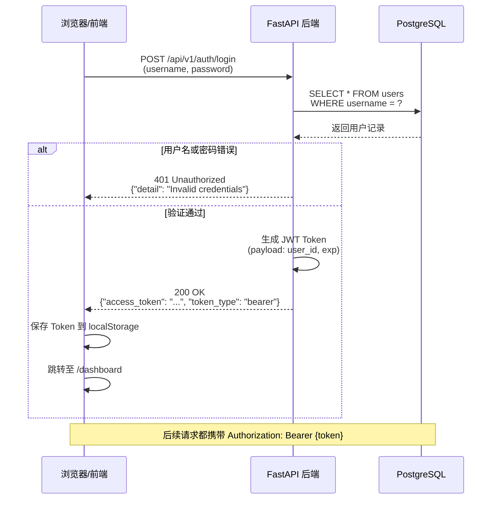

### 3.2 设备上报遥测数据 + 触发告警

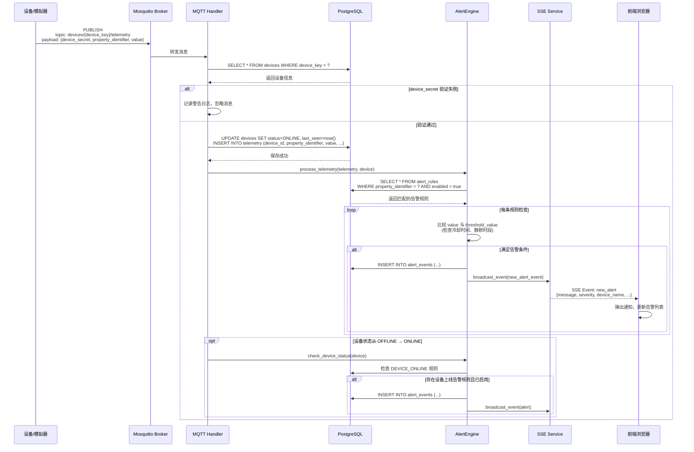

### 3.3 命令下发流程

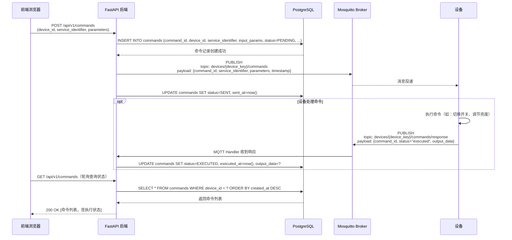

### 3.4 SSE 实时推送连接流程

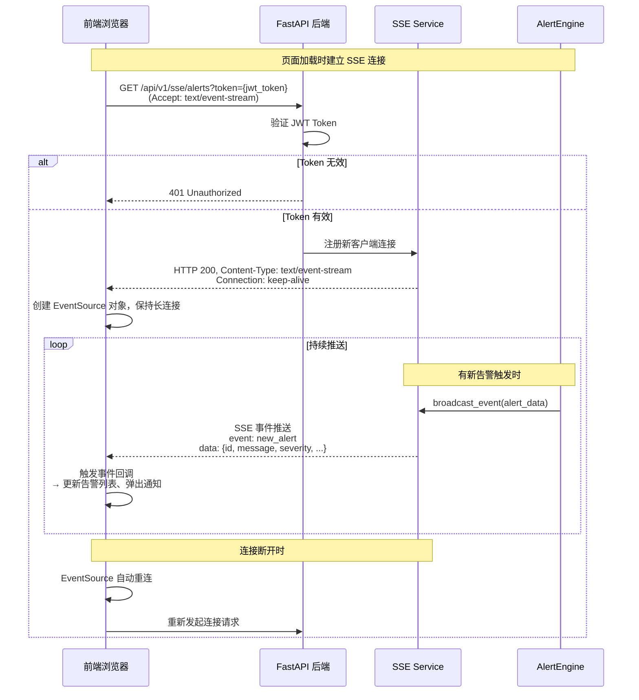

---

## 四、组件图 (Component Diagram)

### 4.1 后端内部组件

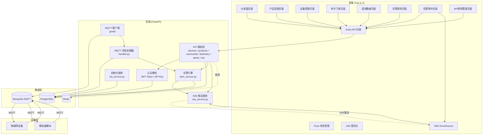

### 4.2 API 模块依赖图

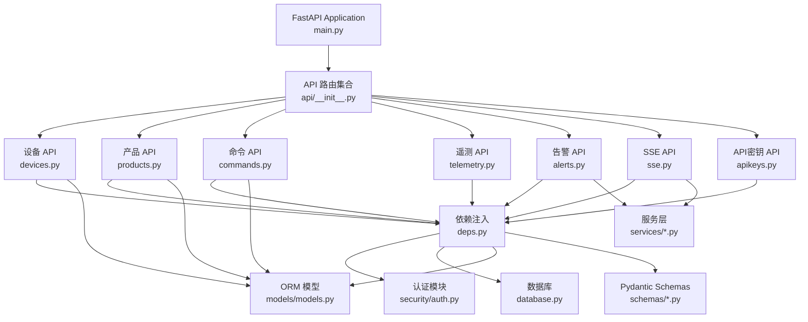

---

## 五、部署图 (Deployment Diagram)

### 5.1 Docker Compose 部署架构

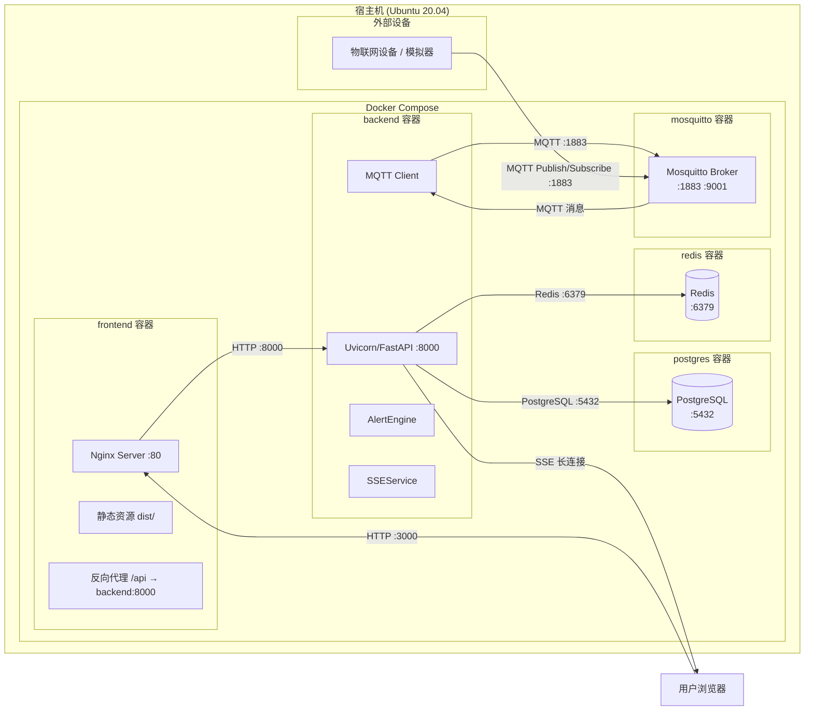

### 5.2 容器间通信拓扑

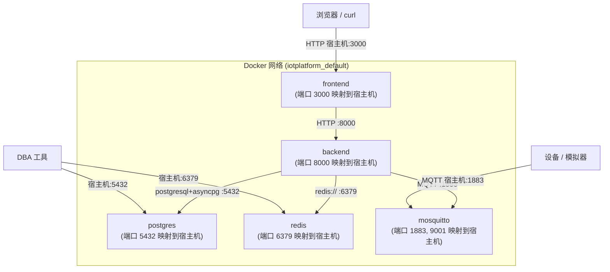

---

## 六、状态图 (State Diagram)

### 6.1 命令状态流转

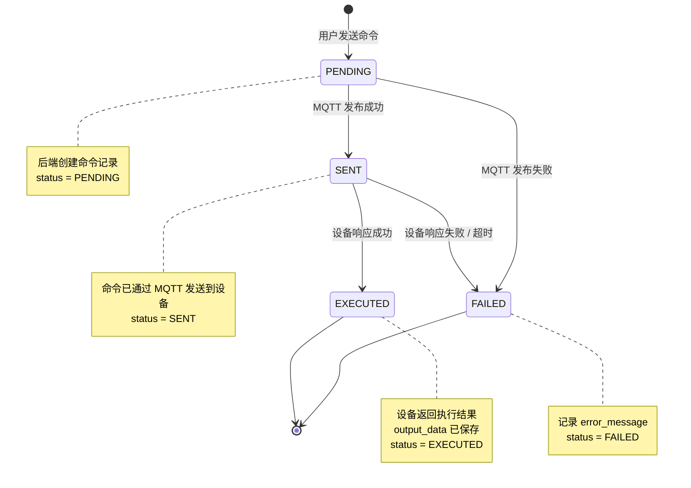

### 6.2 设备状态流转

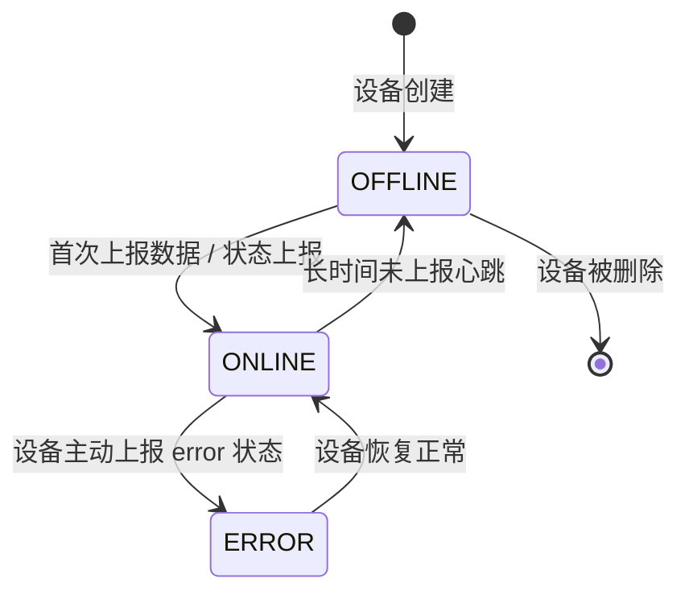

### 6.3 告警事件状态流转

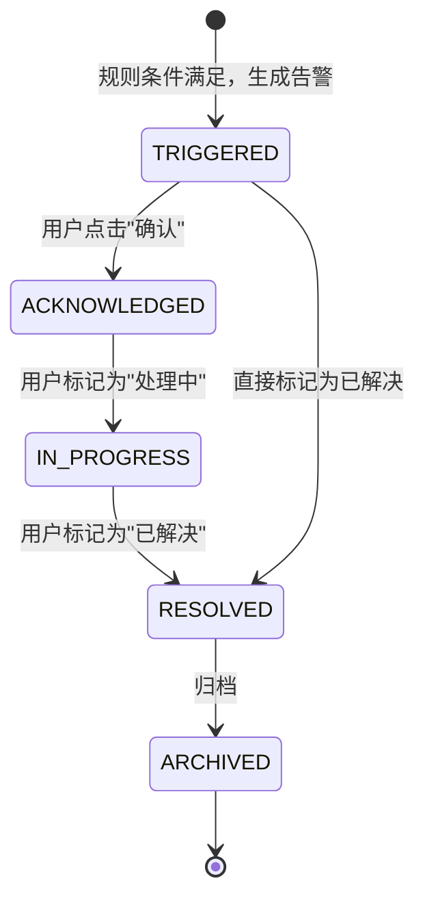

---

## 七、活动图 (Activity Diagram)

### 7.1 告警规则检查流程

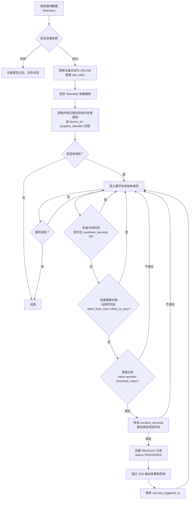

### 7.2 用户从登录到查看告警完整流程

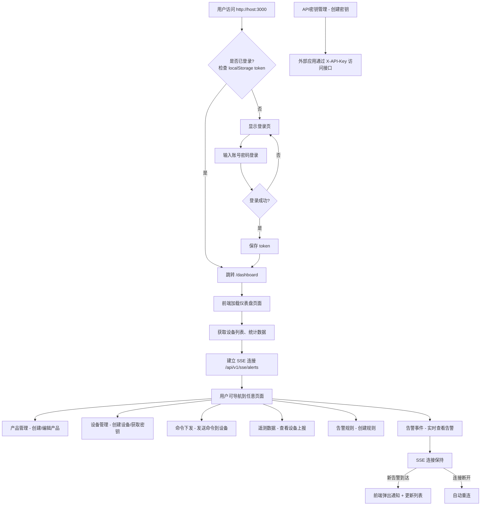

---

## 八、包图 (Package Diagram)

```mermaid
flowchart TB
    subgraph Frontend_Package ["frontend/ Vue.js 3 前端"]
        direction TB
        P1[views/ 页面组件<br/>Dashboard.vue, Devices.vue, Commands.vue, ...]
        P2[stores/ Pinia 状态管理<br/>auth.js, device.js, product.js]
        P3[services/ API 封装<br/>api.js]
        P4[router/ 路由<br/>index.js]
        P5[i18n/ 国际化<br/>locales/zh.js, en.js]
        P6[App.vue & main.js<br/>入口]
    end

    subgraph Backend_Package ["backend/ FastAPI 后端"]
        direction TB
        P10[main.py 应用入口]
        P11[api/ API 路由层<br/>devices.py, products.py, commands.py, telemetry.py, alerts.py, sse.py, apikeys.py, deps.py]
        P12[models/ ORM 模型<br/>models.py (11 个表模型 + 8 个枚举)]
        P13[schemas/ Pydantic Schema<br/>device.py, product.py, command.py]
        P14[security/ 认证模块<br/>auth.py (JWT / API Key)]
        P15[services/ 业务服务层<br/>alert_service.py, sse_service.py, init_service.py]
        P16[mqtt/ MQTT 客户端<br/>service.py, handler.py]
        P17[config.py 配置管理<br/>database.py 数据库连接]
    end

    subgraph Root_Package ["项目根目录"]
        direction TB
        P20[docker-compose.yml 容器编排]
        P21[Dockerfile.backend 后端镜像]
        P22[Dockerfile.frontend 前端镜像]
        P23[mosquitto/ MQTT 配置]
        P24[scripts/ 模拟器脚本<br/>product_device_simulator.py]
        P25[docs/ 文档目录<br/>USER_GUIDE.md, TECHNICAL_MANUAL.md, REQUIREMENTS.md, UML.md, ...]
    end

    P10 --> P11
    P11 --> P12
    P11 --> P13
    P11 --> P14
    P11 --> P15
    P11 --> P16
    P11 --> P17
    P15 --> P12
    P16 --> P15
    P14 --> P12
```

---

## 九、核心 API 时序图汇总

### 9.1 前后端交互总览

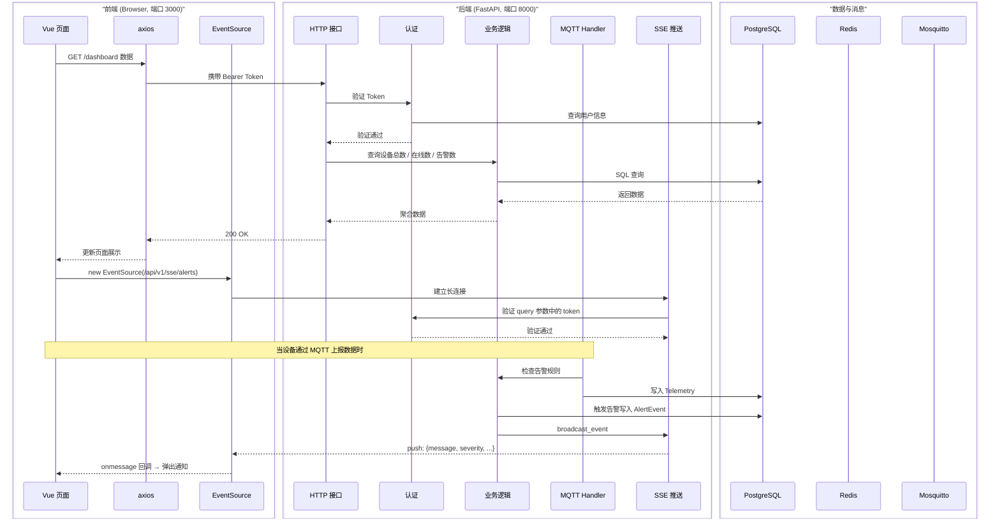

---

## 十、总结

本 UML 文档覆盖了 IOTPlatform 的核心设计：

| 图类型 | 数量 | 内容 |
|--------|------|------|
| 类图 Class Diagram | 2 | 枚举类型 + 核心实体（11 个表 + 8 个枚举） |
| ER 图 ER Diagram | 1 | 完整数据库表关系图 |
| 用例图 Use Case Diagram | 1 | 33 个用例，覆盖用户/设备/第三方应用 |
| 时序图 Sequence Diagram | 4 | 登录、遥测+告警、命令下发、SSE 连接 |
| 组件图 Component Diagram | 2 | 前端/后端/数据层 三层架构 |
| 部署图 Deployment Diagram | 2 | Docker Compose 架构 + 通信拓扑 |
| 状态图 State Diagram | 3 | 命令/设备/告警状态机 |
| 活动图 Activity Diagram | 2 | 告警检查流程 + 用户完整流程 |
| 包图 Package Diagram | 1 | 项目目录结构 |
| **总计** | **16** | 覆盖系统设计的各个维度 |

### 渲染说明

本文档使用 **Mermaid** 语法，可在以下工具中直接渲染：
- VS Code（安装 Mermaid Preview / Markdown Preview Enhanced 插件）
- GitHub（原生支持 Mermaid）
- GitLab
- Typora / Obsidian
- 在线工具：https://mermaid.live
