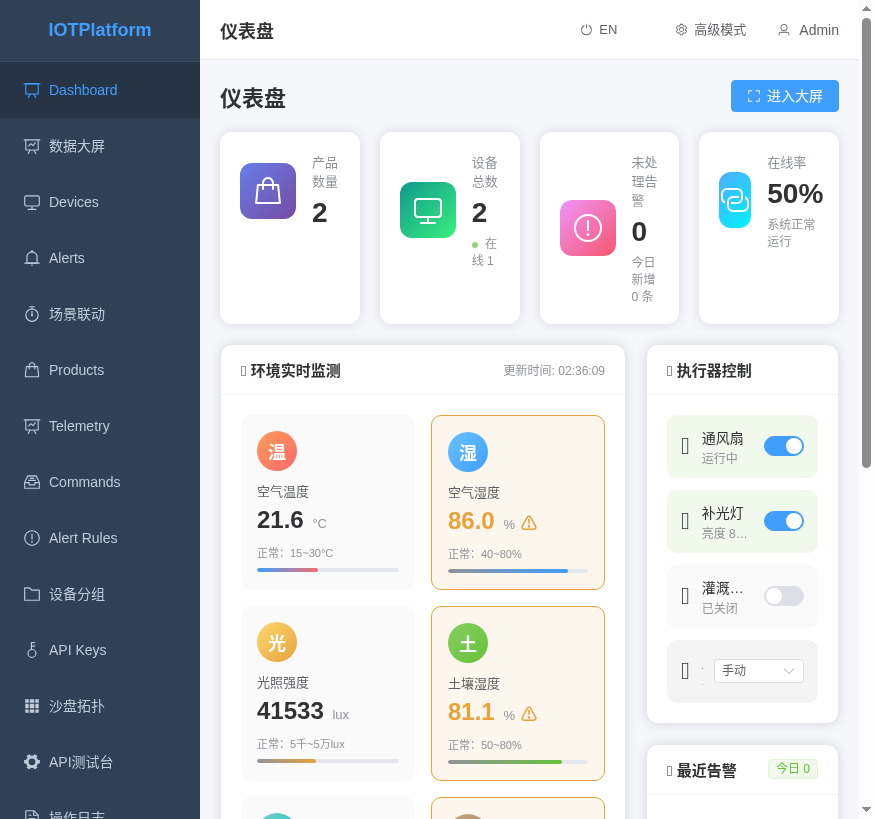
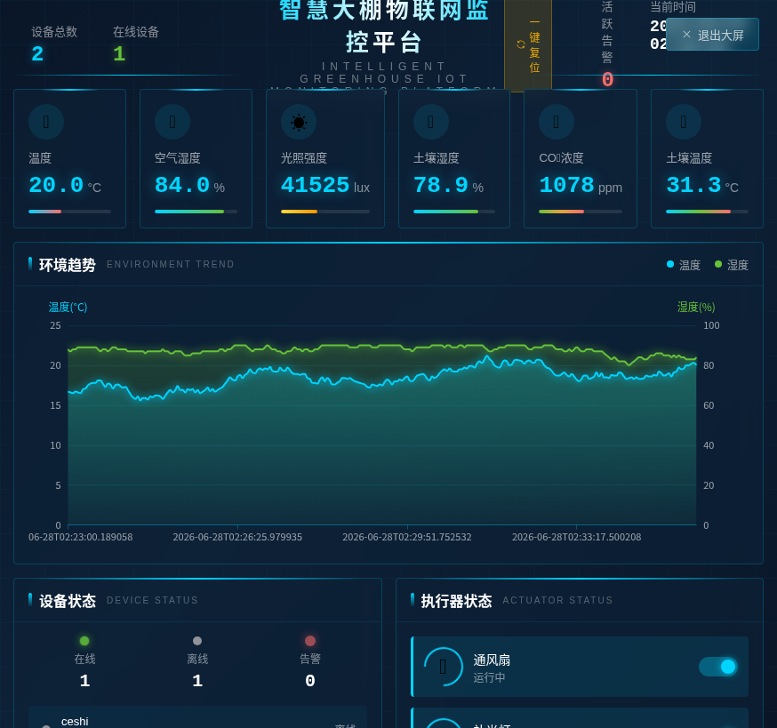

# 智慧大棚物联网平台 - 产品使用手册

## 文档信息

| 项目 | 内容 |
|------|------|
| 产品名称 | 智慧大棚物联网监控平台 |
| 版本 | v1.0 |
| 适用场景 | 农业大棚环境监控、自动化控制 |
| 目标用户 | 农户、农业技术员、农业企业管理人员 |

---

## 目录

1. [产品简介](#1-产品简介)
2. [快速开始](#2-快速开始)
3. [核心功能操作指南](#3-核心功能操作指南)
4. [高级功能](#4-高级功能)
5. [常见问题与故障排除](#5-常见问题与故障排除)

---

## 1. 产品简介

### 1.1 这是什么产品？

智慧大棚物联网监控平台是一套用于监控和管理农业大棚环境的智能系统。

**它能帮您：**
- 实时监测大棚内的温度、湿度、光照、土壤水分等环境数据
- 自动控制通风扇、补光灯、灌溉泵等设备
- 当环境异常时自动告警通知您
- 设置自动化场景，让设备自动根据环境条件运行

### 1.2 界面模式说明

平台提供两种界面模式，适应不同用户需求：

| 模式 | 适用用户 | 显示内容 |
|------|----------|----------|
| **简化模式** | 农户、普通用户 | 核心功能：仪表盘、数据大屏、设备、告警、场景联动 |
| **高级模式** | 技术人员、管理员 | 全部功能：产品管理、遥测数据、命令下发、告警规则、设备分组、API管理等 |

**切换方式：** 点击页面右上角的"简化模式"/"高级模式"按钮即可切换。

### 1.3 主要功能模块

```
┌─────────────────────────────────────────────────────────┐
│                    智慧大棚物联网平台                      │
├─────────────────────────────────────────────────────────┤
│  📊 仪表盘    │ 实时数据总览、环境趋势图表、执行器控制     │
│  🖥️ 数据大屏  │ 大屏展示模式，适合投影/电视观看           │
│  📱 设备管理  │ 查看和管理已连接的大棚设备                 │
│  🔔 告警事件  │ 查看环境异常告警记录                       │
│  ⚡ 场景联动  │ 设置自动化控制规则                         │
│  📦 产品管理  │ 管理设备类型和传感器配置（高级模式）       │
│  📈 遥测数据  │ 查看历史环境数据（高级模式）               │
│  🎮 命令下发  │ 手动向设备发送控制命令（高级模式）         │
│  📋 告警规则  │ 配置告警条件和通知方式（高级模式）          │
└─────────────────────────────────────────────────────────┘
```

---

## 2. 快速开始

### 2.1 一键体验（无需注册）

如果您想快速体验平台功能，可以直接点击登录页的"**一键体验（无需注册）**"按钮，系统将使用演示账号自动登录。



### 2.2 账号登录

如果您有正式账号，可以输入用户名和密码登录：

- **默认管理员账号：** admin / admin123
- **演示账号：** 可使用"一键体验"功能


### 2.3 登录后首页

登录成功后，您将看到**仪表盘**页面，这是平台的首页，显示：

- 系统运行状态
- 设备在线情况
- 实时环境数据
- 最近的告警信息


---

## 3. 核心功能操作指南

### 3.1 查看实时环境数据

在**仪表盘**页面，您可以实时查看大棚内的环境数据：

**查看方式：**
1. 环境数据卡片实时显示当前数值
2. 每个数据卡片下方显示**正常范围**（如：15~30°C）
3. 如果数值超出正常范围，会显示**⚠️警告图标**

**示例：**
```
🌡️ 空气温度：21.4°C  正常：15~30°C  ✅ 正常
💧 空气湿度：84.0%    正常：40~80%   ⚠️ 偏高
🌱 土壤湿度：80.5%    正常：50~80%   ⚠️ 偏高
🪴 土壤温度：31.2°C   正常：15~28°C  ⚠️ 偏高
```

### 3.2 查看环境趋势图

在仪表盘下方，有**环境趋势图**，显示最近6小时的数据变化。

**操作方法：**
1. 点击图例中的选项（温度/湿度/土壤湿度/CO₂）
2. 图表会自动切换显示对应数据的变化趋势


### 3.3 控制执行器设备

您可以在仪表盘底部手动控制大棚设备：

**可控制的设备：**
- 🌀 **通风扇** - 控制大棚通风
- 💡 **补光灯** - 控制植物补光
- 💧 **灌溉水泵** - 控制灌溉系统

**操作方法：**
1. 点击设备旁边的**开关按钮**
2. 开关打开：设备运行（如：通风扇"运行中"，补光灯"亮度 80%"）
3. 开关关闭：设备停止（如："已关闭"）


**设置工作模式：**
您还可以切换设备的工作模式：
- **自动模式** - 设备根据系统自动运行
- **手动模式** - 手动控制设备开关
- **节能模式** - 以节能方式运行

### 3.4 查看数据大屏

**数据大屏**是专为展示设计的大屏视图，适合在电视或投影上播放。

**打开方式：**
1. 在仪表盘点击右上角的"**进入大屏**"按钮
2. 或者点击左侧菜单的"**数据大屏**"

**大屏功能：**
- 设备状态总览（在线/离线/告警数量）
- 设备列表及状态
- 实时传感器数据
- 执行器状态
- 自动化场景运行状态
- 实时告警滚动列表



**退出大屏：** 点击右上角的"**退出大屏**"按钮

### 3.5 查看和管理告警

当环境数据超出正常范围时，系统会自动产生告警。

**查看告警：**
1. 点击左侧菜单的"**告警事件**"
2. 页面显示告警列表，包含：
   - 告警设备名称
   - 告警内容（如："温度 35°C，超过警戒值 30°C"）
   - 告警时间
   - 告警级别（警告/严重/紧急）

**告警级别说明：**
| 级别 | 含义 | 建议 |
|------|------|------|
| ⚪ 信息 | 一般提示 | 可忽略 |
| 🟡 警告 | 需要关注 | 建议检查 |
| 🔴 严重 | 需要处理 | 尽快处理 |
| 🟣 紧急 | 紧急处理 | 立即处理 |

### 3.6 配置自动化场景

**场景联动**功能可以让设备根据环境条件自动运行，无需人工干预。

**使用预设场景：**
系统已为您预设了几个常用场景：

| 场景名称 | 功能说明 | 状态 |
|----------|----------|------|
| 🌅 日间模式 | 自动通风+补光控制 | 运行中 |
| 🌙 夜间模式 | 保温保湿+低功耗 | 已停用 |
| 💧 智能灌溉 | 根据土壤湿度自动灌溉 | 运行中 |

**启用/停用场景：**
1. 点击场景旁边的**开关按钮**
2. 打开 = 启用自动化运行
3. 关闭 = 暂停该场景


---

## 4. 高级功能

> 以下功能在"高级模式"下可用。点击右上角"高级模式"按钮切换。

### 4.1 从模板快速创建产品

如果您需要添加新的大棚设备，可以使用**产品模板**快速配置：

**支持的模板：**

| 模板名称 | 适用场景 | 包含功能 |
|----------|----------|----------|
| 🌱 智慧大棚·基础版 | 小型种植户 | 温湿度、土壤、光照、灌溉 |
| 🏠 智慧大棚·标准版 | 中型大棚 | 基础版 + CO₂、土壤温度 |
| 🚀 智慧大棚·高级版 | 大型农业企业 | 标准版 + 更多传感器 |
| 🐄 智慧畜牧·养殖版 | 畜牧业 | 温湿度、氨气、通风控制 |

**创建方法：**
1. 进入"**产品管理**"页面
2. 点击"**从模板创建**"按钮
3. 选择适合的模板
4. 一键创建，自动配置所有传感器和告警规则


### 4.2 自定义告警规则

在**告警规则**页面，您可以设置更精细的告警条件：

**配置项：**
- **监控属性**：选择要监控的传感器（如：温度、湿度）
- **条件**：设置触发条件（如：大于30°C）
- **阈值**：设置触发值
- **告警级别**：选择严重程度
- **关联场景**：告警触发时可自动执行关联的自动化场景

### 4.3 查看历史数据

在**遥测数据**页面，您可以查看设备的历史数据：

**功能：**
- 按设备筛选
- 按时间范围筛选
- 查看数据趋势图表
- 导出数据（Excel格式）

### 4.4 设备分组管理

使用**设备分组**功能，可以按位置或用途对设备进行归类：

**示例分组：**
- 按区域：东区大棚、西区大棚、南区大棚
- 按用途：育苗区、展示区、生产区

### 4.5 操作日志审计

在**操作日志**页面，可以查看所有用户操作记录：

**记录内容：**
- 登录/登出记录
- 设备控制操作
- 配置修改记录
- 告警确认记录

### 4.6 中英文切换

点击页面右上角的"**中文/EN**"按钮，可以切换界面语言。

---

## 5. 常见问题与故障排除

### 5.1 登录问题

**Q: 无法登录，提示用户名或密码错误？**
> - 检查是否大小写正确
> - 默认账号：admin / admin123
> - 可以尝试"一键体验"功能

**Q: 登录后提示"Token过期"？**
> - 刷新页面或重新登录
> - 点击右上角用户名，选择"退出登录"，重新登录

### 5.2 数据问题

**Q: 传感器数据显示"--"或"无数据"？**
> - 检查设备是否在线
> - 检查设备电源和网络连接
> - 等待几秒后刷新页面

**Q: 数据长期不更新？**
> - 检查设备网络是否正常
> - 重启设备
> - 检查设备sim卡/流量是否充足

**Q: 数据明显异常（如温度显示100°C）？**
> - 可能是传感器故障，联系技术支持
> - 可以先忽略异常数据，联系维修人员

### 5.3 设备控制问题

**Q: 点击开关后设备没有响应？**
> - 检查设备是否在线
> - 检查设备电源是否开启
> - 确认工作模式是否为"手动模式"

**Q: 设备状态显示不同步？**
> - 刷新页面获取最新状态
> - 等待10-30秒让状态同步

### 5.4 告警问题

**Q: 告警一直触发，无法消除？**
> - 检查环境条件是否确实异常
> - 如果环境已恢复正常，告警会在一段时间后自动消除
> - 或手动确认告警

**Q: 告警通知没有收到？**
> - 检查网络连接
> - 确认告警规则是否启用
> - 检查通知设置

### 5.5 其他问题

**Q: 页面显示不完整或错位？**
> - 建议使用Chrome、Edge或Firefox最新版本浏览器
> - 分辨率建议1920x1080或更高
> - 刷新页面或清除浏览器缓存

**Q: 如何联系技术支持？**
> - 查看系统右上角"关于"信息
> - 联系平台管理员

---

## 附录：传感器正常范围参考

| 传感器 | 正常范围 | 说明 |
|--------|----------|------|
| 空气温度 | 15~30°C | 植物生长的适宜温度 |
| 空气湿度 | 40~80% | 过高易生病害，过低易干旱 |
| 光照强度 | 5000~50000 lux | 满足植物光合作用需求 |
| 土壤湿度 | 50~80% | 作物生长适宜含水量 |
| CO₂浓度 | 400~1500 ppm | 植物光合作用原料 |
| 土壤温度 | 15~28°C | 根系生长的适宜温度 |

> 注意：以上为参考范围，实际可根据作物种类适当调整。

---

**文档版本：** v1.0
**最后更新：** 2026年6月28日
