# 智慧农业物联网平台 - 产品使用手册

## 目录

```
第1章 快速入门
第2章 仪表盘
第3章 产品与设备管理
第4章 场景管理
第5章 数据报表
第6章 告警管理
第7章 命令下发
第8章 设置
第9章 高级功能（可选）
```

---

## 第1章 快速入门

本章将帮助您快速了解如何使用智慧农业物联网平台。

### 1.1 登录与账号

#### 登录系统

**操作步骤：**

1. 打开浏览器，输入平台地址，进入登录页面
   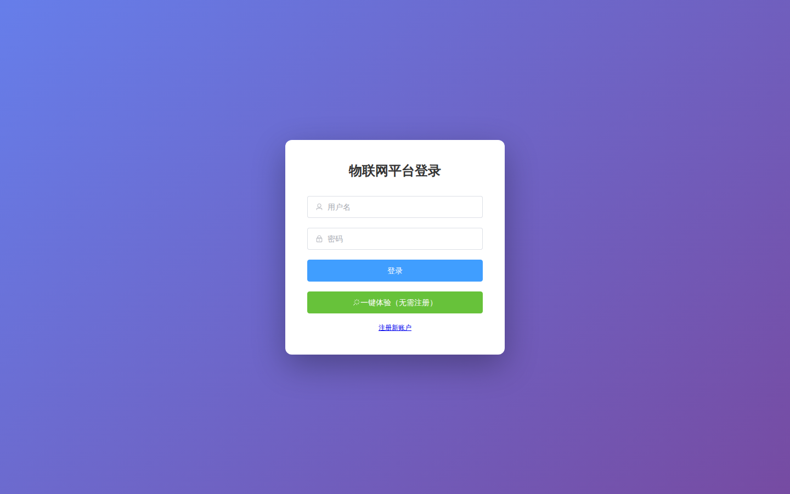

2. 在"用户名"输入框中输入您的账号
3. 在"密码"输入框中输入您的密码
4. 点击"登录"按钮进入系统

**温馨提示：**
- 首次使用请使用管理员分配的账号
- 密码区分大小写，请注意输入正确
- 连续输入错误5次后，账号会被锁定15分钟

---

### 1.2 认识主界面

登录成功后，系统进入主界面，主要包含以下区域：

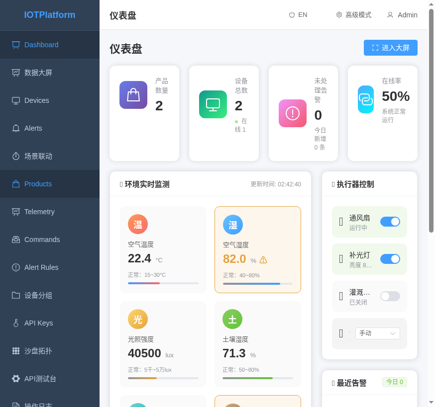

| 区域 | 说明 |
|------|------|
| 顶部导航栏 | 显示当前页面名称、搜索框、消息通知、用户菜单 |
| 左侧菜单栏 | 功能导航菜单，包含仪表盘、产品、设备、场景等 |
| 主内容区 | 显示当前功能模块的具体内容 |
| 底部状态栏 | 显示当前登录用户、在线设备数量 |

**顶部导航栏功能说明：**
- **Logo图标**：点击可快速返回仪表盘首页
- **搜索框**：支持快速搜索设备、产品等信息
- **消息图标**：查看系统通知和告警信息
- **用户头像**：点击展开用户菜单

---

### 1.3 退出登录

**操作步骤：**

1. 点击页面右上角的用户头像
   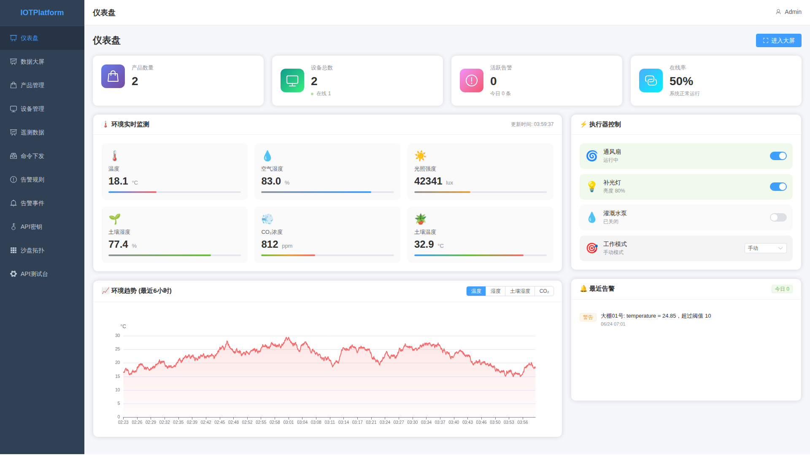

2. 在下拉菜单中点击"退出登录"按钮

3. 系统提示"确定要退出吗？"，点击"确定"

4. 页面跳转到登录页面

**温馨提示：**
- 退出登录后，所有未保存的数据将会丢失
- 建议在公用电脑上使用时，务必退出登录
- 系统支持30分钟无操作自动退出

---

## 第2章 仪表盘

仪表盘是系统的首页，展示农场的整体运行状态。

### 2.1 查看农场概况

仪表盘顶部以卡片形式展示农场的关键数据：

| 数据项 | 说明 |
|--------|------|
| 设备总数 | 当前已接入的所有设备数量 |
| 在线设备 | 当前正常运行的设备数量 |
| 今日告警 | 今日产生的告警事件数量 |
| 命令下发 | 今日下发的控制命令数量 |


**如何刷新数据：**
- 页面数据会自动每30秒刷新一次
- 点击卡片右上角的刷新按钮可手动刷新

---

### 2.2 环境数据总览

仪表盘中部的图表区域展示环境监测数据：

**查看步骤：**

1. 在仪表盘中部找到"环境数据"图表区域

2. 图表默认显示近24小时的数据趋势

3. 将鼠标移到图表数据点上，可查看具体数值

4. 点击图表上方的"温度"、"湿度"、"光照"等标签，可切换显示不同指标

**图表操作说明：**
- **缩放**：使用鼠标滚轮可放大或缩小时间范围
- **平移**：按住鼠标左键拖动可移动查看时间范围
- **重置**：点击右上角"重置"按钮恢复默认视图

---

### 2.3 设备状态一目了然

仪表盘底部的设备状态列表展示所有设备：

**查看设备状态：**

1. 在仪表盘底部找到"设备状态"区域

2. 设备以列表形式展示，每行显示一个设备

3. 列表包含：设备名称、所属产品、在线状态、最后上报时间

4. **状态指示：**
   - 🟢 绿色图标：设备在线
   - 🔴 红色图标：设备离线
   - 🟡 黄色图标：设备告警

**快速定位问题设备：**
- 点击"只看离线"按钮，筛选出离线设备
- 点击"只看告警"按钮，筛选出告警设备

---

### 2.4 快捷操作入口

仪表盘右侧提供常用功能的快捷入口：

| 功能 | 说明 |
|------|------|
| 告警事件 | 快速查看最新告警，点击进入告警详情 |
| 场景联动 | 快速进入场景管理，创建自动化规则 |
| 数据大屏 | 进入数据可视化大屏，全屏展示数据 |
| 沙盘拓扑 | 查看设备拓扑关系图 |

**操作步骤：**

1. 点击任意快捷入口卡片

2. 系统直接跳转到对应功能页面

3. 无需通过左侧菜单层层查找

---

## 第3章 产品与设备管理

### 3.1 产品管理

产品是对一类设备的抽象定义，包含设备的公共属性和功能。

#### 查看产品列表

**操作步骤：**

1. 在左侧菜单中点击"产品管理"
   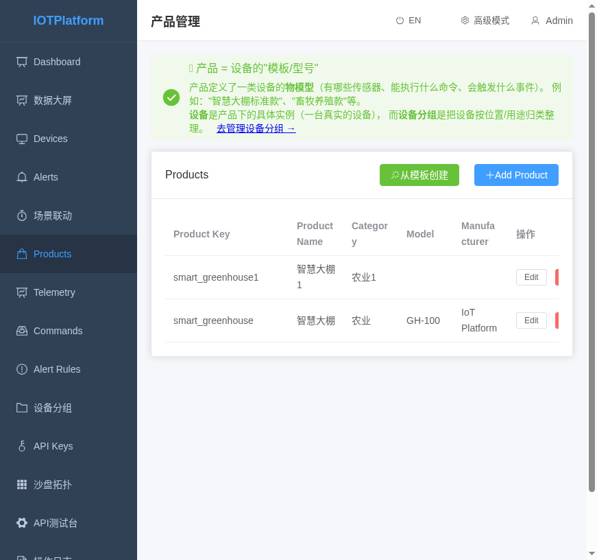

2. 进入产品管理页面，查看所有已创建的产品

3. 产品列表显示：产品名称、产品类型、协议类型、创建时间、设备数量

#### 创建新产品

**操作步骤：**

1. 在产品管理页面，点击右上角"新增产品"按钮

2. 在弹出的表单中填写以下信息：
   - **产品名称**：输入产品名称（如：温室大棚）
   - **产品类型**：选择设备类型
   - **协议类型**：选择通信协议（MQTT/CoAP/HTTP）
   - **数据格式**：选择数据格式（JSON/二进制）

3. 点击"确认"按钮完成创建

4. 创建成功后，自动进入产品详情页面

#### 管理产品

**查看产品详情：**
1. 在产品列表中点击产品名称，进入产品详情

**编辑产品：**
1. 在产品详情页面，点击右上角"编辑"按钮
2. 修改需要更新的信息
3. 点击"保存"按钮

**删除产品：**
1. 在产品列表中，点击产品右侧的"删除"按钮
2. 系统提示"删除后无法恢复，确定删除吗？"
3. 点击"确定"完成删除
4. **注意**：产品下存在设备时无法删除

---

### 3.2 设备管理

设备是实际存在的物联网终端设备。

#### 查看设备列表

**操作步骤：**

1. 在左侧菜单中点击"设备管理"
   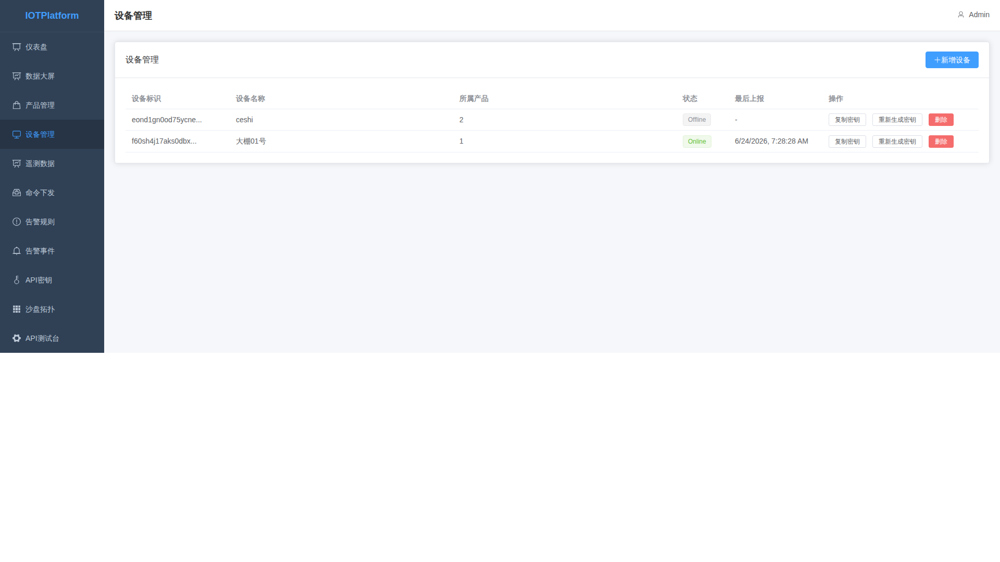

2. 进入设备管理页面，查看所有设备

3. 设备列表显示：设备名称、设备编码、产品类型、在线状态、创建时间

#### 添加新设备

**操作步骤：**

1. 在设备管理页面，点击右上角"新增设备"按钮

2. 在弹出的表单中填写以下信息：
   - **设备名称**：输入设备名称
   - **所属产品**：从下拉列表选择产品
   - **设备编码**：输入唯一编码（如：DEVICE_001）
   - **安装位置**：输入设备安装位置
   - **经纬度**：输入设备GPS坐标（可选）

3. 点击"确认"按钮完成添加

4. 添加成功后，系统显示设备接入凭证（DeviceToken）

#### 管理设备

**查看设备详情：**
1. 在设备列表中点击设备名称，进入设备详情页面

**编辑设备信息：**
1. 在设备详情页面，点击右上角"编辑"按钮
2. 修改设备信息
3. 点击"保存"按钮

**删除设备：**
1. 在设备详情页面，点击右上角"删除"按钮
2. 确认删除后，设备将从列表中移除

---

### 3.3 分组管理

设备分组功能可以按区域或类型对设备进行归类管理。

#### 查看分组

**操作步骤：**

1. 在左侧菜单中点击"设备分组"
   

2. 进入分组管理页面

3. 分组以树形结构展示，最顶层为默认分组

#### 创建分组

**操作步骤：**

1. 在分组管理页面，点击右上角"新建分组"按钮

2. 在弹出的表单中填写：
   - **分组名称**：输入分组名称（如：1号大棚）
   - **上级分组**：选择上级分组（默认为根分组）
   - **分组描述**：输入分组说明

3. 点击"确认"按钮完成创建

#### 分配设备到分组

**操作步骤：**

1. 在分组管理页面，点击分组右侧的"分配设备"按钮

2. 在设备列表中勾选要分配到该分组的设备

3. 点击"确认"按钮完成分配

4. 设备可以属于多个分组

---

## 第4章 场景管理

场景联动功能可以实现设备的自动化控制。

### 4.1 创建场景联动

**操作步骤：**

1. 在左侧菜单中点击"场景联动"
   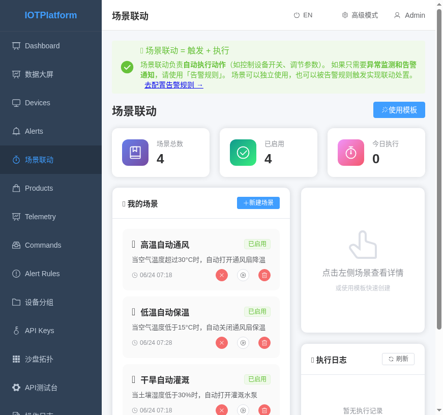

2. 进入场景管理页面，点击右上角"创建场景"按钮

3. 在创建页面填写以下信息：

   **基本信息：**
   - **场景名称**：输入场景名称（如：高温自动通风）
   - **触发条件**：设置触发条件的设备、指标和阈值

   **执行动作：**
   - **执行设备**：选择要控制的设备
   - **控制指令**：选择要下发的命令（如：开启、关闭）
   - **延时设置**：设置命令执行延迟时间

4. 点击"保存"按钮完成创建

**场景联动示例：**

| 场景名称 | 触发条件 | 执行动作 |
|----------|----------|----------|
| 高温通风 | 温度 > 35°C | 开启风扇 |
| 干旱灌溉 | 土壤湿度 < 30% | 开启水泵 |
| 光照不足 | 光照强度 < 200 lux | 开启补光灯 |
| 夜间告警 | 时间 22:00-06:00 + 检测到移动 | 发送告警通知 |

### 4.2 管理场景规则

**启用/停用场景：**

1. 在场景列表中，点击场景右侧的开关按钮
2. 开启：开关显示蓝色，场景生效
3. 关闭：开关显示灰色，场景暂停

**编辑场景：**
1. 点击场景右侧的"编辑"按钮
2. 修改场景配置信息
3. 点击"保存"按钮

**删除场景：**
1. 点击场景右侧的"删除"按钮
2. 确认删除后，场景将被移除

**查看执行记录：**
1. 点击场景右侧的"日志"按钮
2. 查看该场景的触发时间和执行结果

---

## 第5章 数据报表

### 5.1 遥测数据查询

遥测数据是设备上报的传感器数据。

**操作步骤：**

1. 在左侧菜单中点击"遥测数据"
   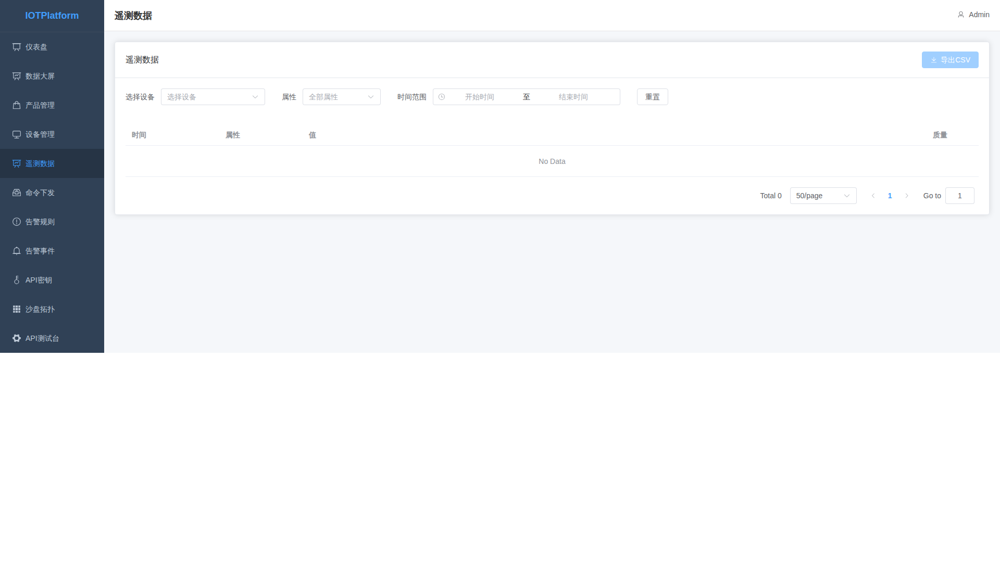

2. 进入遥测数据查询页面

3. 设置查询条件：
   - **设备选择**：选择要查询的设备（支持多选）
   - **时间范围**：选择查询的时间段
   - **数据指标**：选择要查询的指标类型

4. 点击"查询"按钮

5. 查询结果以表格形式展示，包含：时间、设备、指标名称、指标值

**数据可视化：**
- 点击"图表"视图，可查看数据趋势图
- 支持折线图、柱状图切换
- 可导出数据为CSV格式

### 5.2 导出历史数据

**操作步骤：**

1. 在遥测数据页面，设置好查询条件

2. 点击右上角"导出"按钮

3. 选择导出格式（CSV/Excel）

4. 选择导出时间范围

5. 点击"导出"开始下载

6. 导出完成后，浏览器自动下载文件

**温馨提示：**
- 单次导出最大支持10万条数据
- 大数据量导出可能需要等待较长时间

---

## 第6章 告警管理

### 6.1 查看告警事件

**操作步骤：**

1. 在左侧菜单中点击"告警事件"
   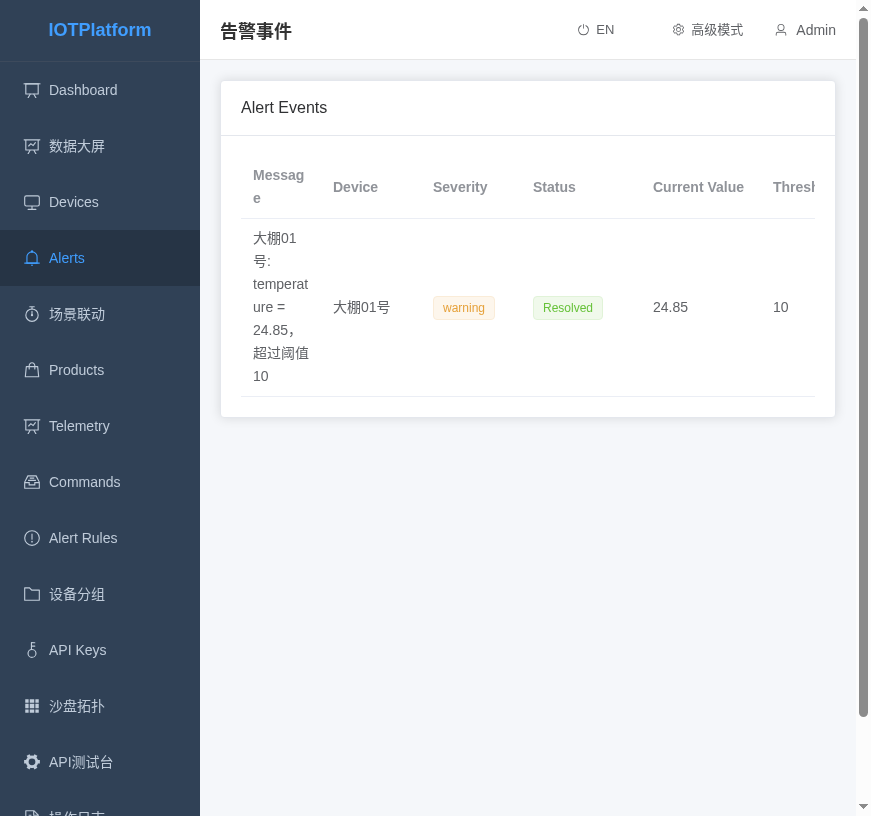

2. 进入告警事件页面，查看所有告警记录

**统计卡片：**

页面顶部以卡片形式展示告警统计数据：

| 卡片 | 说明 |
|------|------|
| 总告警 | 最近7天内的告警总数 |
| 严重 | 严重级别的告警数量 |
| 警告 | 警告级别的告警数量 |
| 待处理 | 尚未处理的告警数量 |

**搜索与筛选：**

1. 在搜索框中输入设备名称或告警信息，实时筛选
2. 使用"状态筛选"下拉框选择：全部/待处理/已确认/已解决
3. 使用"级别筛选"下拉框选择：全部/严重/错误/警告/信息
4. 点击"刷新"按钮重新加载数据

**告警列表显示：**

告警列表显示以下信息：
- **告警信息**：告警的详细描述
- **设备**：触发告警的设备名称
- **监测指标**：触发告警的传感器指标
- **告警级别**：告警的严重程度
- **当前值**：触发告警时的指标数值
- **阈值**：告警触发的阈值
- **状态**：告警处理状态
- **创建时间**：告警产生的时间

**告警级别说明：**

| 级别 | 图标颜色 | 说明 |
|------|----------|------|
| 严重 | 🔴 红色 | 需要立即处理 |
| 错误 | 🟠 橙色 | 需要尽快处理 |
| 警告 | 🟡 黄色 | 可以稍后处理 |
| 信息 | 🔵 蓝色 | 信息提醒 |

**处理告警：**

1. **确认告警**：点击"确认"按钮，表示已看到并开始处理该告警
   - 确认后告警状态变为"已确认"

2. **解决告警**：点击"解决"按钮，表示问题已处理完毕
   - 解决后告警状态变为"已解决"

**操作说明：**
- 只有"待处理"状态的告警可以点击"确认"按钮
- 任何非"已解决"状态的告警都可以点击"解决"按钮
- 操作成功后，页面会自动刷新并显示最新状态

### 6.2 配置告警规则

**操作步骤：**

1. 在左侧菜单中点击"告警规则"
   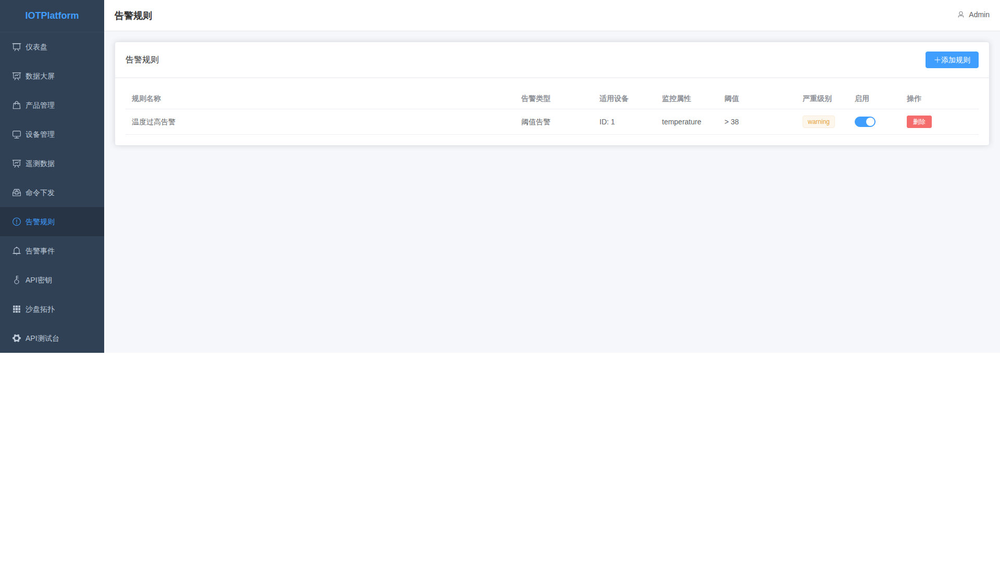

2. 进入告警规则配置页面

3. 点击右上角"新增规则"按钮

4. 在表单中填写规则配置：

   **规则信息：**
   - **规则名称**：输入规则名称
   - **所属产品**：选择关联的产品
   - **指标类型**：选择要监测的指标

   **触发条件：**
   - **条件类型**：选择条件（大于、小于、等于、区间）
   - **阈值**：输入触发阈值
   - **持续时间**：设置告警触发需要满足条件的持续时间

   **告警设置：**
   - **告警级别**：选择告警级别
   - **告警方式**：勾选通知方式（短信/邮件/站内消息）
   - **通知对象**：选择接收通知的人员

5. 点击"保存"按钮完成配置

**告警规则示例：**

| 规则名称 | 监测指标 | 触发条件 | 告警级别 |
|----------|----------|----------|----------|
| 温度过高 | 温度 | > 35°C 持续5分钟 | 紧急 |
| 湿度过低 | 土壤湿度 | < 30% 持续10分钟 | 重要 |
| 设备离线 | 在线状态 | 离线超过30分钟 | 重要 |
| 电量不足 | 电量 | < 20% | 一般 |

---

## 第7章 命令下发

### 7.1 下发控制命令

通过平台可以远程控制设备执行特定操作。

**操作步骤：**

1. 在左侧菜单中点击"命令下发"
   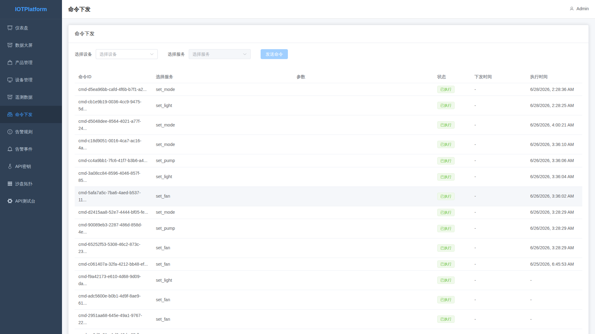

2. 进入命令下发页面

3. 点击右上角"下发命令"按钮

4. 在弹出的表单中填写：
   - **目标设备**：选择要控制的设备
   - **命令类型**：选择命令类型（如：开关、调节参数）
   - **命令参数**：输入命令参数值

5. 点击"确认"按钮下发命令

6. 命令下发后，系统显示下发结果

**常用命令示例：**

| 命令名称 | 适用设备 | 命令参数 | 说明 |
|----------|----------|----------|------|
| 开关控制 | 风扇、水泵、灯 | on/off | 开启或关闭设备 |
| 调节转速 | 变频风机 | 转速值(0-100) | 调节设备转速 |
| 设置温度 | 温控器 | 温度值 | 设置目标温度 |
| 重启设备 | 所有设备 | 无 | 重启设备 |

### 7.2 查看命令记录

**操作步骤：**

1. 在命令下发页面，点击"命令记录"标签

2. 查看所有下发过的命令记录

3. 记录列表显示：下发时间、设备名称、命令类型、参数、状态

**命令状态说明：**

| 状态 | 说明 |
|------|------|
| 已发送 | 命令已下发，等待设备响应 |
| 发送成功 | 设备已接收并执行命令 |
| 发送失败 | 命令下发失败 |
| 超时 | 设备未在规定时间内响应 |

**重新下发：**
- 对于发送失败或超时的命令，可点击"重试"按钮重新下发

---

## 第8章 设置

### 8.1 账号与安全

#### 修改个人信息

**操作步骤：**

1. 在左侧菜单中点击"设置"，或点击用户头像
   

2. 进入设置页面，点击"个人信息"标签

3. 可修改以下信息：
   - **头像**：点击头像区域上传新图片
   - **昵称**：输入新的昵称
   - **手机号**：输入新的手机号
   - **邮箱**：输入新的邮箱

4. 点击"保存"按钮

#### 修改密码

**操作步骤：**

1. 在设置页面，点击"修改密码"标签

2. 填写以下信息：
   - **原密码**：输入当前密码
   - **新密码**：输入新密码
   - **确认密码**：再次输入新密码

3. 点击"确认"按钮

**密码要求：**
- 密码长度8-20位
- 必须包含字母和数字
- 不能与用户名相同

### 8.2 帮助与关于

#### 查看帮助文档

**操作步骤：**

1. 在设置页面，点击"帮助文档"标签

2. 查看平台的使用帮助

3. 点击目录可快速跳转到对应章节

#### 查看系统信息

**操作步骤：**

1. 在设置页面，点击"关于"标签

2. 查看系统版本、版权信息

3. 页面显示：
   - **系统版本**：当前平台版本号
   **版权声明**：版权所有方信息
   - **技术支持**：联系方式

---

## 第9章 高级功能（可选）

本章介绍平台的高级功能，适合技术人员和运维人员使用。

### 9.1 数据大屏

数据大屏提供全屏展示的农场数据可视化界面，适合在监控中心或大屏幕上展示。

**进入数据大屏：**

1. 在左侧菜单中点击"数据大屏"
   

2. 进入数据大屏页面

**功能说明：**

| 区域 | 内容 |
|------|------|
| 顶部标题栏 | 显示农场名称和当前时间 |
| 左侧数据面板 | 展示设备统计、告警统计等汇总数据 |
| 中间主图区 | 以图表形式展示环境监测数据趋势 |
| 右侧设备列表 | 实时显示设备在线状态 |
| 底部实时数据 | 滚动展示最新的传感器数据 |

**操作说明：**

- **全屏模式**：点击右上角"全屏"按钮，进入全屏展示模式
- **退出全屏**：按 ESC 键或点击右上角"退出"按钮
- **自动轮播**：大屏支持自动轮播多个数据视图
- **数据刷新**：数据每30秒自动刷新一次

**使用场景：**
- 监控中心大屏展示
- 领导视察数据汇报
- 农场展览展示

---

### 9.2 设备拓扑

设备拓扑以图形化方式展示设备之间的关系和连接状态。

**查看设备拓扑：**

1. 在左侧菜单中点击"设备拓扑"
   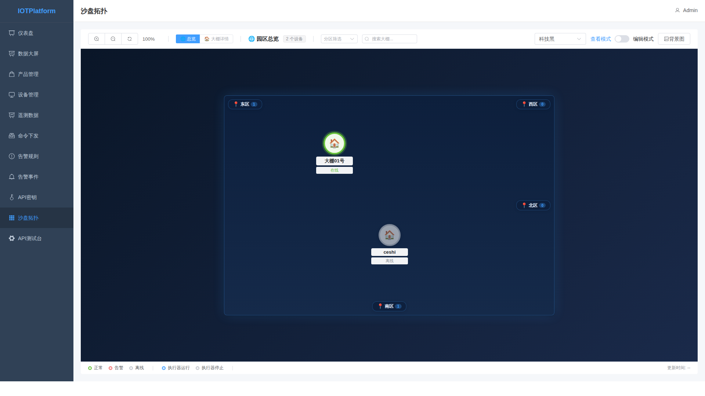

2. 进入拓扑图页面

**拓扑图元素说明：**

| 元素 | 说明 |
|------|------|
| 节点 | 代表单个设备或设备组 |
| 连线 | 表示设备之间的通信连接 |
| 图标颜色 | 绿色=在线，红色=离线，黄色=告警 |

**操作说明：**

- **缩放**：使用鼠标滚轮缩放拓扑图
- **拖拽**：按住鼠标左键拖动可移动视图
- **查看详情**：点击设备节点，显示设备详情弹窗
- **筛选**：使用顶部筛选器按产品或状态筛选设备
- **布局切换**：支持树状图、星状图、环形图等布局

---

### 9.3 API密钥管理

API密钥用于第三方系统调用平台接口。

**查看API密钥：**

1. 在左侧菜单中点击"API密钥"
   

2. 进入API密钥管理页面

**功能说明：**

| 字段 | 说明 |
|------|------|
| 密钥名称 | 密钥的描述名称 |
| AppKey | 应用的唯一标识符 |
| AppSecret | 应用的密钥密码 |
| 创建时间 | 密钥创建日期 |
| 状态 | 启用/禁用状态 |

**创建新的API密钥：**

1. 点击右上角"创建密钥"按钮

2. 在弹出的表单中填写：
   - **密钥名称**：输入密钥描述（如：数据对接系统）
   - **权限范围**：选择接口权限（只读/读写）

3. 点击"确认"按钮

4. **重要**：在弹窗中复制并保存 AppKey 和 AppSecret，关闭后将无法再次查看

**使用API密钥：**

调用接口时需要在请求header中携带：
```
X-App-Key: your_app_key
X-App-Secret: your_app_secret
```

**安全建议：**
- 定期更换API密钥
- 不要在客户端代码中硬编码密钥
- 为不同系统创建不同的密钥，便于管理

---

### 9.4 API测试台

API测试台提供在线接口调试功能，无需编写代码即可测试平台接口。

**进入API测试台：**

1. 在左侧菜单中点击"API测试台"
   

2. 进入API测试台页面

**功能说明：**

| 区域 | 说明 |
|------|------|
| 接口列表 | 左侧展示所有可用API接口 |
| 请求参数区 | 中间填写接口请求参数 |
| 响应结果区 | 右侧显示接口返回结果 |

**测试API接口：**

1. 从左侧接口列表中选择要测试的接口

2. 在请求参数区填写：
   - **Headers**：设置请求头（如AppKey、AppSecret）
   - **参数**：填写接口需要的参数

3. 点击"发送"按钮

4. 在右侧查看：
   - **状态码**：请求结果状态
   - **响应时间**：接口响应耗时
   - **返回数据**：接口实际返回内容

**常用接口示例：**

| 接口名称 | 功能 | 适用场景 |
|----------|------|----------|
| 获取设备列表 | 查询所有设备 | 设备数据同步 |
| 获取遥测数据 | 查询传感器数据 | 数据分析 |
| 下发设备命令 | 控制设备 | 远程控制 |

**提示：**
- 测试台仅用于调试，正式环境请使用SDK或直接调用接口
- 测试环境数据与生产环境隔离

---

### 9.5 操作日志

操作日志记录所有用户在平台上的操作行为，便于审计和问题排查。

**查看操作日志：**

1. 在左侧菜单中点击"操作日志"
   

2. 进入操作日志页面

**日志列表说明：**

| 字段 | 说明 |
|------|------|
| 操作时间 | 操作发生的具体时间 |
| 操作人 | 执行操作的用户账号 |
| 操作类型 | 操作类别（登录、创建、修改、删除等） |
| 操作对象 | 操作涉及的实体（如设备名称、产品名称） |
| 操作详情 | 具体的操作内容 |
| IP地址 | 操作时的用户IP地址 |

**筛选日志：**

1. 使用顶部筛选器可以按以下条件筛选：
   - **时间范围**：选择查询的时间段
   - **操作类型**：选择特定操作类型
   - **操作人**：输入用户名筛选

2. 点击"查询"按钮查看结果

**导出日志：**

1. 设置好筛选条件后

2. 点击右上角"导出"按钮

3. 选择导出格式（CSV/Excel）

4. 下载包含筛选结果的日志文件

**日志保留说明：**
- 操作日志默认保留90天
- 超过保留期限的日志会自动清理
- 如需更长期保存，可联系管理员配置备份策略

---

## 附录

### 常用操作入口速查表

| 功能需求 | 操作路径 |
|----------|----------|
| 登录系统 | 输入账号密码，点击登录 |
| 查看农场数据 | 仪表盘 |
| 添加设备 | 设备管理 > 新增设备 |
| 创建场景 | 场景联动 > 创建场景 |
| 查看告警 | 告警事件 |
| 控制设备 | 命令下发 > 下发命令 |
| 导出数据 | 遥测数据 > 导出 |

### 状态指示灯说明

| 图标 | 含义 |
|------|------|
| 🟢 | 在线/正常 |
| 🔴 | 离线/异常 |
| 🟡 | 告警/警告 |
| 🔵 | 信息/提示 |
| ⚪ | 未知/未定义 |

### 常见问题解答

**Q: 设备显示离线怎么办？**
A: 检查设备是否通电、网络连接是否正常、SIM卡是否欠费。

**Q: 命令下发成功但设备没反应？**
A: 确认设备是否支持该命令，检查设备是否在线，查看命令记录详情。

**Q: 无法登录系统？**
A: 检查账号密码是否正确，联系管理员确认账号状态。

**Q: 数据没有更新？**
A: 确认设备是否正常上报数据，检查网络连接，尝试刷新页面。

---

*本手册基于智慧农业物联网平台编写，如有更新恕不另行通知。*
*版权所有 © 2024 智慧农业物联网平台*
